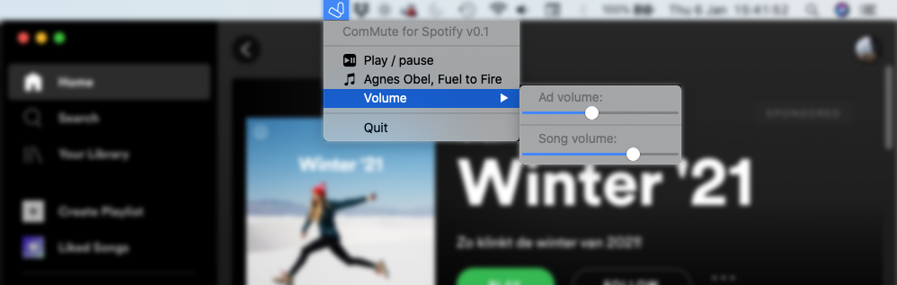

# ComMute for Spotify
Quieter Commercial Ads for Spotify Free on macOS

&nbsp;

Spotify Free can be a great service. Unfortunately the ads can be a true pain to the ears, especially when you're enjoying calmer music. ComMute for Spotify will adjust Spotify's volume whenever ads are playing.

## Usage

ComMute lives in your menu bar. On every track change in Spotify, ComMute adjusts Spotify's volume. This does not adjust your overall output volume, so it doesn't interfere with other apps.

ComMute lets you set the volume for ads and songs. Note that Spotify does not allow to set the ad volume all the way to 0 (this halts playback). The menu bar icon shows if Spotify is muted or not: 

There is also a button to play/pause Spotify, and a display of the current song. Click the current song to copy artist, title, and URL to your clipboard, for easy sharing with your friends.

## How it works

ComMute watches for creation of the file `ad-state-storage.bnk.tmp` in `~/Library/Application Support/Spotify/Users/<spotify user>/`. This file is created every time Spotify changes track, which triggers ComMute to request the current track info with Spotify through an AppleScript request. Depending on the track info, ComMute sends another AppleScript request to update the volume setting.

Settings are stored in `~/.config/ComMute.conf`. The file format is very simple: `<watchfile>\n<ad volume>\n<song volume>`

Thanks to Simon Meusel for the documentation of his previous work: https://github.com/simonmeusel/MuteSpotifyAds (discontinued)
